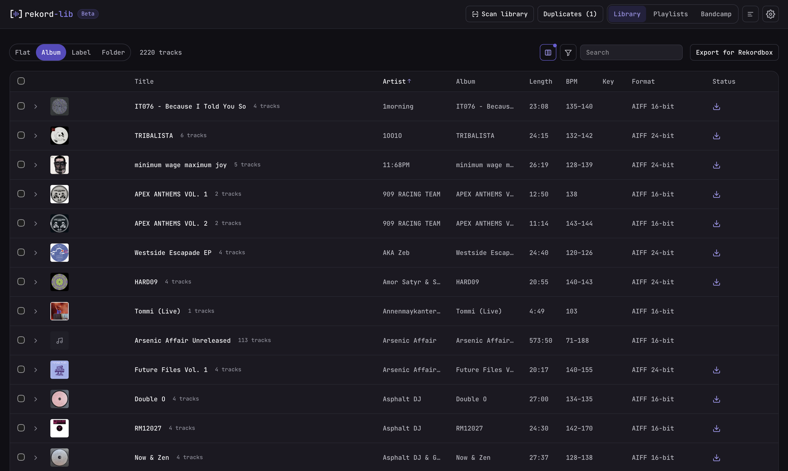

<div align="center">

<picture>
  <source media="(prefers-color-scheme: dark)" srcset="src/assets/brand/rekord-lib-logo-horizontal-dark.svg">
  
</picture>

**Prepare a music library so it runs without error codes on every Pioneer CDJ/XDJ — and stays clean in Rekordbox.**

A local-first desktop app for macOS. Tauri 2 · React 19 · Rust.

[](https://github.com/timheinrichs/rekord-lib/actions/workflows/ci.yml)
[](https://github.com/timheinrichs/rekord-lib/releases/latest)
[](LICENSE)
[](https://www.paypal.com/donate/?hosted_button_id=UJGTJEK598ZFS)

</div>

<!-- Drop a window screenshot here as docs/media/screenshot.png (PNG, retina is
     fine, the width attribute scales it). Until it exists GitHub shows the alt
     text, so the README stays readable either way. -->
<div align="center">
  
</div>

---

## What it does

Dropping a folder of purchases onto a USB stick is where the trouble starts: a
96 kHz file that a CDJ-2000 refuses with **E-8305**, an AIFF-C the player cannot
read, three copies of the same track under three different names, and half the
tags missing. rekord-lib fixes all of that in one pass over a library it keeps
track of, without uploading anything anywhere.

- **Managed library** — one central folder, recursive scan with cancelable
  progress. The track database lives in SQLite, so the list is on screen
  immediately at startup and a rescan only re-reads files that actually changed.
- **Conversion** to a target format (default **AIFF**), correcting what players
  reject: resampling above 48 kHz down to 44.1 kHz, uncompressed PCM instead of
  AIFF-C, 16- or 24-bit. FLAC/ALAC are flagged as CDJ-3000/NXS2-only. External
  files can be dragged in.
- **Metadata editor** with suggestions from the filename, MusicBrainz and —
  once an API key is configured (kept in the macOS Keychain) — Discogs,
  required-field checks, and bulk edit across a selection.
- **Covers** — embedded artwork as thumbnails, falling back to a `cover.jpg`
  next to the audio, which conversion then embeds.
- **Duplicate detection** across formats and filenames, by length, acoustic
  fingerprint and name similarity. It runs at the end of every scan that changed
  the library, and fingerprints are cached — so a repeat run decodes nothing.
  Groups you wave off stay gone.
- **Bandcamp** — log in, sync your purchases, download with progress straight
  into the library.
- **The list** — filter and search, grouping by album, label or folder,
  multi-select with shift ranges, virtualized for large collections.

Per-version detail: [CHANGELOG.md](CHANGELOG.md). How it compares to Rekordbox,
and what it deliberately does not do:
[docs/COMPARISON.md](docs/COMPARISON.md). Where it might go next:
[docs/FUTURE_CONSIDERATIONS.md](docs/FUTURE_CONSIDERATIONS.md).

## Install

Prebuilt for **macOS on Apple Silicon** (M-series).

1. Download the latest `rekord-lib_x.y.z_aarch64.dmg` from the
   [releases page](https://github.com/timheinrichs/rekord-lib/releases/latest).
2. Open the `.dmg` and drag **rekord-lib** into *Applications*.
3. The app is not signed with an Apple Developer certificate, so Gatekeeper
   warns on first launch. Either **right-click → Open** and confirm once, or
   clear the quarantine flag:

   ```sh
   xattr -dr com.apple.quarantine /Applications/rekord-lib.app
   ```

From then on it **updates itself**: it checks for a newer release on start and
shows an indicator; install any time from **Settings → About → Install &
restart**.

## Support

rekord-lib is free and MIT-licensed. If it saves you an evening of re-encoding,
you can chip in towards its development:

[](https://www.paypal.com/donate/?hosted_button_id=UJGTJEK598ZFS)

---

## Development

### Prerequisites

- **Node 22** — see `.nvmrc`, then `nvm use`
- **Rust** (stable) plus the Tauri prerequisites for macOS
- The `ffmpeg`/`ffprobe` sidecars in `src-tauri/binaries/`
  (`ffmpeg-aarch64-apple-darwin`, `ffprobe-aarch64-apple-darwin`)

  > These are **static** builds that link only against system libraries, which
  > is what lets the bundle run on a Mac with no Homebrew. Regenerate them with
  > `scripts/build-static-ffmpeg.sh` or the *Build ffmpeg sidecars* workflow —
  > never by copying Homebrew binaries, which crash with
  > `dyld: Library not loaded` on other machines. CI enforces this through the
  > `audio::sidecar::sidecars_are_self_contained` test.

### Run

```sh
nvm use
npm install
npm run tauri dev
```

### Checks

All four must be green before committing anything non-trivial:

```sh
npx tsc --noEmit                 # frontend types
npm test                         # frontend unit tests + flow tests (Vitest)
cd src-tauri && cargo check      # Rust backend
cd src-tauri && cargo test       # Rust unit tests
```

Two more exist and are not part of that gate, because they build and drive the
real app and take minutes rather than seconds. Run them before a release:

```sh
npm run typecheck:e2e            # the e2e suite's own types
npm run e2e                      # build the app and drive it (WebdriverIO)
```

### Build

```sh
npm run tauri build -- --target aarch64-apple-darwin
```

The `.dmg` lands in `src-tauri/target/aarch64-apple-darwin/release/bundle/dmg/`.
Self-updater artifacts (`*.app.tar.gz` + `.sig`) and `latest.json` are only
produced when the updater signing key is present — normally in CI, not locally.

### Project structure

```
src/                    React frontend (components, lib, tokens/styles)
src-tauri/src/          Rust backend
  audio/                probe, conversion, duplicates/fingerprint
  bandcamp/             login, collection, download
  db/                   SQLite: tracks, edits, fingerprints, duplicates
  metadata/             read/write tags, cover, suggestions
docs/brand/             styleguide + design tokens
```

Persistence is split deliberately: anything that grows with the collection lives
in SQLite and is written from Rust, while `tauri-plugin-store` keeps only small
config-shaped state. See the *Persistence* section of
[CLAUDE.md](CLAUDE.md).

### Documentation

How the app actually works is documented per feature area — the scan and its
caches, duplicate detection, the compatibility rules, tags and undo, the
command surface, and how the whole thing is tested. Index:
[docs/README.md](docs/README.md). Contribution rules and
how to run the app without damaging a real collection:
[CONTRIBUTING.md](CONTRIBUTING.md).

### Hardware validation

CDJ compatibility is only as good as what has actually been played on a player.
[docs/CDJ_TEST_MATRIX.md](docs/CDJ_TEST_MATRIX.md) records which scenarios were
validated on which model. AIFF output has run on a CDJ-2000nexus, a CDJ-3000 and
an XDJ-700 through a Rekordbox export, with covers and tags reading correctly;
the resampling and AIFF-C cases the app exists for are still untested on
hardware, and the file says which.

### Design

The visual identity is fixed: colors only through tokens
(`src/styles/tokens.css`), dark as the default. Authoritative styleguide:
[docs/brand/STYLEGUIDE.md](docs/brand/STYLEGUIDE.md).

### IDE

[VS Code](https://code.visualstudio.com/) with
[Tauri](https://marketplace.visualstudio.com/items?itemName=tauri-apps.tauri-vscode)
and [rust-analyzer](https://marketplace.visualstudio.com/items?itemName=rust-lang.rust-analyzer).

## Releases

- **Semantic Versioning**; every change recorded in
  [CHANGELOG.md](CHANGELOG.md) (Keep a Changelog).
- Bump the version in **three** places — `package.json`,
  `src-tauri/Cargo.toml`, `src-tauri/tauri.conf.json` — then `cargo check` to
  sync `Cargo.lock`, add the CHANGELOG entry, commit.
- Cut the release by pushing a tag. `.github/workflows/release.yml` builds the
  `.dmg`, the updater artifacts and `latest.json`, and publishes the GitHub
  Release — which is what makes the update available to installed apps.

  ```sh
  git tag -a vX.Y.Z -m "vX.Y.Z"
  git push origin vX.Y.Z
  ```

  This needs **"Immutable releases" switched OFF** (repo *Settings → General*).
  With it on, a published release turns read-only before the assets are attached
  and the upload fails; set `releaseDraft: true` in the workflow and publish the
  draft by hand instead.

### Updater signing (one-time)

The self-updater verifies releases with a minisign keypair.

1. `npm run tauri signer generate -- -w ~/.tauri/rekord-lib.key`
2. Put the **public key** into `src-tauri/tauri.conf.json`
   (`plugins.updater.pubkey`).
3. Add the **private key** and its password as repository secrets:
   `TAURI_SIGNING_PRIVATE_KEY`, `TAURI_SIGNING_PRIVATE_KEY_PASSWORD`.

Never commit the private key.

## License

rekord-lib is [MIT](LICENSE) licensed.

The distributed app bundles third-party components under their own licenses —
notably the **FFmpeg** binaries (LGPL/GPL), which are *not* covered by MIT. See
[THIRD_PARTY_LICENSES.md](THIRD_PARTY_LICENSES.md).
